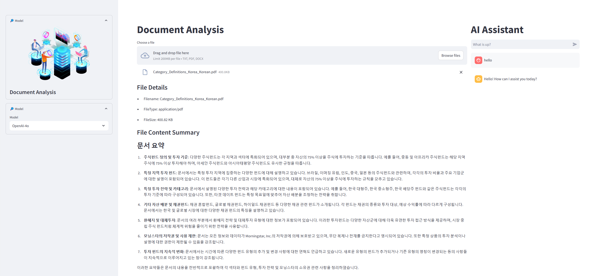

Linux run:

kill process 
netstat -ano | findstr :8501
python -m streamlit run D:\Git\hanghaeAI2\W6_2_Advance\FinanceNews\app.py

cd  D:\Program\Anaconda\Scripts

python -m streamlit run C:\Users\jjin\Jason\Project\MyGit\hanghaeAI2\W6_2_Advance\FinanceNews\app.py

